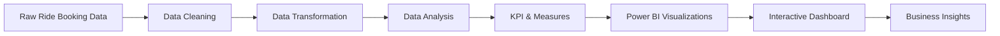

```[README.md](https://github.com/user-attachments/files/33169403/README.md)```
# 🚗 Uber Ride Booking Analysis Dashboard

<p align="center">
  
</p>

<p align="center">
  <strong>Turning ride-booking data into clear business insights.</strong><br>
  An interactive Power BI dashboard for analyzing bookings, revenue, distance, vehicle performance and customer/driver ratings.
</p>

<p align="center">
  <a href="#-dashboard-overview">Dashboard</a> •
  <a href="#-key-metrics">KPIs</a> •
  <a href="#-key-insights">Insights</a> •
  <a href="#-analysis-questions">Questions</a> •
  <a href="#-project-workflow">Workflow</a> •
  <a href="#-project-files">Files</a>
</p>

---

## 📌 Dashboard Overview

This project presents an **Uber ride-booking analysis dashboard built in Microsoft Power BI**.

The dashboard brings multiple business metrics into one view, including:

- Completed bookings
- Lost bookings
- Revenue
- Total distance
- Average trip distance
- Revenue by vehicle type
- Booking trends by month/quarter
- Completed bookings by pickup and drop location
- Customer ratings
- Driver ratings

The goal is to make booking and revenue patterns easier to understand through interactive visual analysis.

---

## 📊 Key Metrics

| KPI | Dashboard Value |
|---|---:|
| 🚕 **Completed Bookings** | **93K** |
| ⚠️ **Lost Bookings** | **57K** |
| 💰 **Revenue** | **52M** |
| 🛣️ **Total Distance** | **2.51M** |
| 📍 **Average Distance** | **24.64** |
| ⭐ **Average Customer Rating** | **4.40** |
| ⭐ **Average Driver Rating** | **4.23** |

> Values above are taken from the current dashboard view.

---

## 🎛️ Interactive Dashboard Features

### 📅 Time Analysis
The dashboard provides **Month** and **Quarter** views for exploring booking and revenue trends over time.

### 🚘 Vehicle Analysis
Revenue is compared across:

- Auto
- Bike
- Go Mini
- Go Sedan
- Premier Sedan
- Uber XL

### 📍 Booking Location Analysis
Completed booking metrics are shown by:

- Pickup location
- Drop location

### ⭐ Rating Analysis
Separate KPI cards provide:

- Average Customer Rating: **4.40**
- Average Driver Rating: **4.23**

---

## 💡 Key Insights

### 1. Completed vs. Lost Bookings

The dashboard shows:

- **93K completed bookings**
- **57K lost bookings**

This comparison provides a high-level view of successful versus unsuccessful booking outcomes.

### 2. Revenue Performance

The dashboard reports approximately:

> **52M total revenue**

Revenue is also broken down by vehicle type, making it possible to compare the contribution of different vehicle categories.

### 3. Vehicle-Type Revenue

In the current dashboard view, **Auto** has the highest visible revenue bar among the displayed vehicle types.

Other categories include Bike, Go Mini, Go Sedan, Premier Sedan and Uber XL.

### 4. Monthly Booking Performance

The completed-bookings chart shows month-to-month variation across the year.

The dashboard also provides a **Month / Quarter** switch so the trend can be viewed at different time granularities.

### 5. Average Trip Distance

The dashboard reports:

> **24.64 average distance**

while total distance is approximately:

> **2.51M**

### 6. Customer and Driver Experience

The dashboard reports:

> ⭐ **4.40 Average Customer Rating**

and

> ⭐ **4.23 Average Driver Rating**

---

## ❓ Analysis Questions

<details>
<summary><strong>🚕 How many bookings were completed?</strong></summary>

The dashboard currently shows **93K completed bookings**.
</details>

<details>
<summary><strong>⚠️ How many bookings were lost?</strong></summary>

The dashboard currently shows **57K lost bookings**.
</details>

<details>
<summary><strong>💰 What is the total revenue?</strong></summary>

The dashboard currently reports approximately **52M revenue**.
</details>

<details>
<summary><strong>🚘 Which vehicle type generates the most revenue?</strong></summary>

In the current dashboard view, **Auto** has the highest visible revenue bar among the displayed vehicle categories.
</details>

<details>
<summary><strong>📅 How does booking performance change over time?</strong></summary>

The completed-bookings chart allows comparison of monthly and quarterly patterns using the **Month / Quarter** controls.
</details>

<details>
<summary><strong>⭐ What are the customer and driver ratings?</strong></summary>

The dashboard reports an average customer rating of **4.40** and an average driver rating of **4.23**.
</details>

---

## 🖼️ Dashboard Preview

### Main Dashboard

<p align="center">
  
</p>

### Dashboard Layout

```text
┌──────────────────────────────────────────────────────────┐
│                    UBER ANALYTICS                        │
├──────────────────────────────────────────────────────────┤
│ Completed │ Lost │ Revenue │ Distance │ Avg Distance     │
├──────────────────────────────────────────────────────────┤
│ Completed Bookings Trend      Revenue by Vehicle Type   │
├──────────────────────────────────────────────────────────┤
│ Completed / Lost Status       Revenue Trend             │
├──────────────────────────────────────────────────────────┤
│ Pickup │ Drop Location │ Customer Rating │ Driver Rating │
└──────────────────────────────────────────────────────────┘
```

---

## 🧠 Project Workflow



---

## 🔄 Analysis Process

### 01 — Data Understanding
Reviewed booking, revenue, distance, vehicle and rating-related fields to identify the metrics needed for analysis.

### 02 — Data Cleaning
Prepared the data for analysis by checking data types, consistency and fields required for dashboard calculations.

### 03 — Data Transformation
Structured the data so it could be analyzed by time, vehicle type and booking-related dimensions.

### 04 — KPI Development
Created high-level metrics for completed bookings, lost bookings, revenue, distance and ratings.

### 05 — Visualization
Designed the dashboard using KPI cards, line/area charts, bar charts, status indicators and rating visuals.

### 06 — Business Storytelling
Combined the visuals into a single dashboard so users can quickly understand booking and revenue performance.

---

## 🛠️ Tools & Technologies

| Tool | Purpose |
|---|---|
| 📊 **Power BI** | Dashboard development & visualization |
| 🔄 **Power Query** | Data cleaning & transformation |
| 📈 **Data Analysis** | KPI and trend analysis |
| 🎨 **Data Visualization** | Business storytelling |
| 📗 **Excel / Dataset** | Source data preparation, if applicable |

---

## 📁 Recommended Project Structure

```text
uber-ride-booking-analysis/
│
├── 📂 Data/
│   └── Uber_Ride_Booking_Data.xlsx
│
├── 📂 Dashboard/
│   └── Uber_Ride_Booking_Dashboard.pbix
│
├── 📂 Images/
│   └── uber-dashboard-preview.png
│
└── 📄 README.md
```

---

## 📥 Project Files

### 📊 Power BI Dashboard

**[📥 Download Uber Dashboard (.pbix)](Dashboard/Uber_Ride_Booking_Dashboard.pbix)**

### 📗 Dataset

**[📥 View / Download Dataset](Data/Uber_Ride_Booking_Data.xlsx)**

> Update these filenames if your actual `.pbix` or dataset uses different names.

---

## 🌐 Live Project Preview

The `.pbix` file cannot be executed directly inside a GitHub README.

For the current portfolio version, this repository provides:

- 🖼️ High-quality dashboard preview
- 📊 Original Power BI file
- 📗 Dataset
- 📝 Complete project documentation
- 🔍 Analysis methodology
- 📈 Key dashboard insights

### Optional GitHub Pages Version

If you later create an `index.html` dashboard/project showcase, add the link here:
```
**[🚀 Open Live Project Website](https://YOUR-USERNAME.github.io/uber-ride-booking-analysis/)**
```
---

## 📈 Skills Demonstrated

- Power BI
- Power Query
- Data cleaning
- Data transformation
- Exploratory data analysis
- KPI development
- Time-series analysis
- Revenue analysis
- Vehicle-category analysis
- Data visualization
- Dashboard design
- Business storytelling

---

## 🎯 Project Outcome

The final dashboard converts raw ride-booking information into a **single decision-friendly analytical view**.

> **Bookings → Revenue → Distance → Vehicle Performance → Customer & Driver Experience**

---

## 👨‍💻 About Me

### Kishan Parvadiya

**Product Designer | Data Analyst | Aspiring Product Manager**

I enjoy combining **design, data and product thinking** to create clear, useful and visually engaging digital experiences.

🌐 **Portfolio:** [Visit My Portfolio](https://new-kishan-portfolio.vercel.app/)

🐙 **GitHub:** [Explore My Projects](https://github.com/kishanpatel486630)

💼 **LinkedIn:** [Connect with Me](https://www.linkedin.com/in/kishan-parvadiya-593120268/)

---

## ⭐ Support

If you found this project useful or interesting, consider giving the repository a ⭐.

<p align="center">
  <strong>🚗 Turning ride-booking data into meaningful insights.</strong>
</p>
